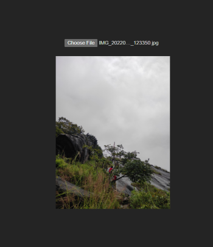

# Cloudinary Image Upload

<!--  -->

This project is built in React using Vite as a build tool. The objective of this project is to explore Cloudinary, a cloud-based service that lets you store, transform, optimize, and deliver images and videos at scale. Cloudinary is the de facto solution for developers and marketers to manage images, videos, and other rich media assets and deliver an optimal end-user experience.

## Technologies  Used

 * React
 * Vite
 * Axios

 ## Getting Started

1. Clone the repository to your local machine.
2. Install the dependencies using npm install.
3. Run the development server using npm run dev.

## Usage

 * Open the application in your browser.
 * Click on the “Choose File” button to select an image to upload.
 * Click on the “Upload” button to upload the selected image to Cloudinary.
 * The uploaded image will be displayed on the page.

### Acknowledgments

 * Cloudinary for providing the cloud-based service.
 * Vite for providing the build tool.
 * Axios for providing the HTTP client.

# React + Vite

This template provides a minimal setup to get React working in Vite with HMR and some ESLint rules.

Currently, two official plugins are available:

- [@vitejs/plugin-react](https://github.com/vitejs/vite-plugin-react/blob/main/packages/plugin-react/README.md) uses [Babel](https://babeljs.io/) for Fast Refresh
- [@vitejs/plugin-react-swc](https://github.com/vitejs/vite-plugin-react-swc) uses [SWC](https://swc.rs/) for Fast Refresh

## Contributing

Contributions are welcome! Please feel free to submit a pull request.